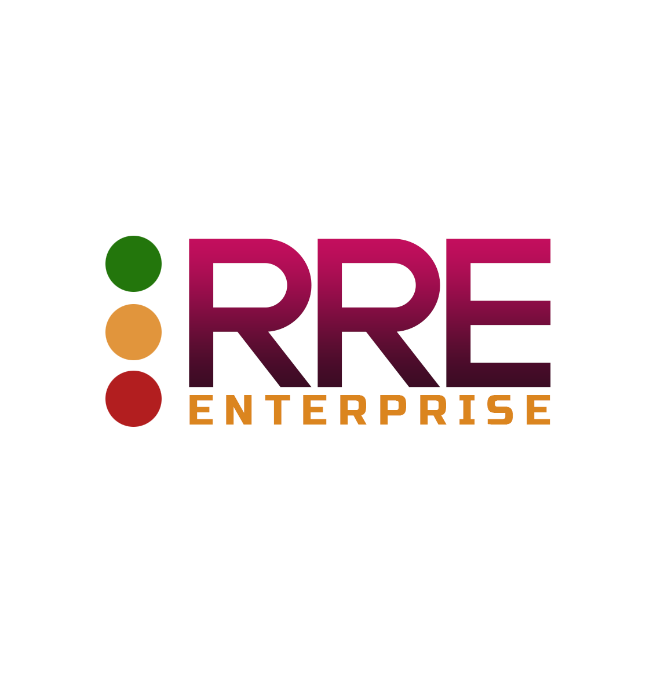

Rated Ranking Evaluator-Enterprise
==========================

*the next generation of free Search Quality Evaluation Tools for Elasticsearch/Apache Solr search engines*

This repository contains the docker compose instructions to pull RRE-Enterprise from docker-hub and run it locally.
For additional information and for a free product-key:

<a href="https://sease.io/rated-ranking-evaluator-enterprise">Rated Ranking Evaluator Enterprise</a>

## How To Run RRE-Enterprise   

To start the RRE-Enterprise ecosystem:

```
docker-compose up 
```  
  
Now you need to insert the product-key you received by e-mail after the registration:
[Didn't register yet? Do it now!](https://sease.io/rated-ranking-evaluator-enterprise)  
```
curl -X POST -F 'user=<userMail>' -F 'productKey=<productKey>' http://localhost:8081/1.0/rre-enterprise-api/license-api/activate
```

* RRE-Enterprise runs at http://localhost:3001
  
For more information on how to use RRE-Enterprise we have prepared this Blog Post series:

• <a href="https://sease.io/2022/06/rre-enterprise-how-to-manage-your-ratings.html">How to Manage Your Ratings</a><br>
• <a href="https://sease.io/2022/06/rre-enterprise-how-to-set-up-your-target-search-engine.html">How to Setup Your Target Search Engine</a><br>
• <a href="https://sease.io/2022/06/rre-enterprise-how-to-manage-your-data-collections.html">How to Manage Your Data Collections</a><br>
• <a href="https://sease.io/2022/07/rre-enterprise-how-to-run-an-evaluation.html">How to Run an Evaluation</a><br>
• <a href="https://sease.io/2022/07/rre-enterprise-evaluation-overview-dashboard.html">Evaluation Overview Dashboard</a><br>
• <a href="https://sease.io/2022/08/rre-enterprise-evaluation-explore-compare-dashboard.html">Evaluation Explore/Compare Dashboard</a><br>
• <a href="https://sease.io/2022/08/rre-enterprise-make-explicit-ratings-easy.html">Make Explicit Ratings Easy</a><br>
• <a href="https://sease.io/2022/08/query-discovery-in-rre-enterprise.html">Query Discovery</a><br>
• <a href="https://sease.io/2022/09/id-discovery-in-rre-enterprise.html">ID Discovery</a><br>
  
To destroy your environment (including any volumes created like the mysql db), just run:
```
docker-compose down -v
```  
